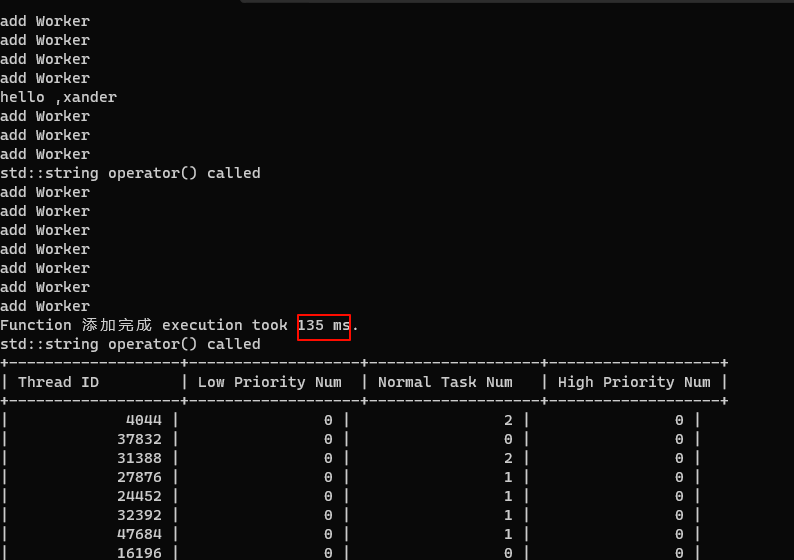

# xanderPool简介

[English](README.md)


xanderPool是一个易用简单、高性能、跨平台、内存自动管理、线程安全、header-only、基于任务优先级的C++ 17线程池。它设计的目标是成为一个足够简单的、优雅高效的线程池，提供各种提交任务方式，设计模式、逻辑简单清晰明了。现代c++代码风格。

非静态线程池，线程数量动态调节。

基于c++标准库不依赖其他任何库，易于集成。可以快速上手，提交任务对象就可以高效利用系统线程资源。

使用：由于xanderPool是header-only的，意味着无需编译直接拷贝xanderPool/include目录到你的项目中即可。

## 快速提交一个任务并获取结果

```cpp
//使用Pool单例提交匿名lamda任务计算1.2的3次方,返回一个TaskResult异步对象
 auto asyncResult1 = Pool::instance()->submit([](double a,double b)
 {
         return pow(a, b);

 },1.2,3);
//syncGetResult在此阻塞直到任务完成
 double restlt = asyncResult1->syncGetResult();//1.7279999999999
```

非常简单明了，xanderPool使用submit函数提交任务，使用异步结果TaskResult获取结果。到此已经可以正常使用xanderPool了。只需要一直使用提供的单例对象往里面添加各种任务即可。

# 详细介绍

#### xanderPool的几个概念

1. 池子(pool）:接受任务并分配给worker，并管理着workers。
2. 任务（task）：可调用对象的封装。
3. 任务处理者（worker）。
4. 任务结果（taskResult）


你只需创建Pool实例。提交任务。返回给你任务结果，之后Pool会自动分配你的任务，并自动管理Worker，执行完通过任务结果获取就行了。

#### 提交各种可调用对象：

1. 全局函数

```cpp
long long globalFibFunction(int n)
{
    if  (n <= 1)
    {
  
        return n;
    }
    else
    {
        return globalFibFunction(n - 1) + globalFibFunction(n - 2);

    }
}

```

2. 成员函数和伪函数

```cpp
 class ClassA
 {
 public:
    //成员函数
     std::string memberFunction(int a, double b)
     {
         this_thread::sleep_for(std::chrono::milliseconds(300));
         return  std::to_string(a) + std::to_string(b);
     }
    //伪函数
    std::string operator() (){
         printf_s("fake function called \n");
         return  "fake func";
    }
 };
ClassA aobj;
```

3. lambda

```cpp
  auto lambdaFunction = []()
      {
          printf_s("hello ,xander \n");

      };
```

##### 使用Pool匿名提交

```cpp
    Pool pool1 = Pool();
    pool1.submit(TaskBase::low, []() {});
    pool1.submit(TaskBase::Normal,globalFibFunction, 12);
    pool1.submit(TaskBase::High,&ClassA::memberFunction, &aobj, 1, 2);
    pool1.submit(aobj);
```

##### 非匿名提交（通过makeTask先构造）

```cpp
    auto task1 = makeTask(TaskBase::Normal, []() {});
    auto task2 = makeTask(TaskBase::High, globalFibFunction, 12);
    auto task3 = makeTask(TaskBase::Low, &ClassA::memberFunction, ClassA(), 1, 2);
    auto task4 = makeTask( aobj);
    pool1.submit(task1);
    pool1.submit(task2);
    pool1.submit(task3);
    pool1.submit(task4);
```

所有xanderPool可以提交几乎所有类型的可调用对象，并且可以随处创建随处提交，请使用全局函数makeTask创建任何类型的任务。

##### 批量提交

Pool的submitSome函数接受一组任务。

```cpp
  auto task11 = makeTask([]()
      {
      std::cout<<"task11"<<std::endl;
          return 1;
      });

  auto task12 = makeTask([]()
      {
          std::cout << "task12" << std::endl;

           return "ssss";
      });

  pool1.submitSome({ task11,task12 });
  int task11Result = task11->getTaskResult()->syncGetResult();
```

此函数没有返回值，如果想得到结果可以由代码所示的通过Task找到结果（通过getTaskResult函数）。这个设计的原因是因为task11和task12可能具有不同的返回值，那么submitSome函数应当返回tuple吗？考虑到tuple获取值时候使用的std::get的麻烦，不如直接使用task自身去获取自己的结果对象。

##### 任务的复制

同一个Task只能被提交给Worker一次，如果向想多次执行同一个任务，task提供了一个copy函数，可以方便的复制。

```cpp
pool1.submitSome({ task11,task12 });
pool1.submitSome({ task11->copy(),task12->copy()->setPriority(TaskBase::High)});
```

复制了task11和task12并把task12的优先级提高到High再次执行。

#### 任务结果的获取

除了批量添加任务需要由任务自身获取结果，详情见批量提交。其他所有submit得返回值一律是TaskResultPtr,它包装了返回值的异步结果。接下来演示一个例子。

```cpp
     std::vector<TaskResultPtr<TaskBase::Priority>> asyncResult;//异步结果
   for (int i = 0; i < 1000; ++i)
   {
    auto r =    pool1.submit([this]()
           {
               return randomPriority();
           });
    asyncResult.push_back(r);
   }
   std::vector<TaskBase::Priority> results;//结果
   for (auto r : asyncResult)
   {
     auto res =   r->syncGetResult();
     results.push_back(res);
   }


```

提交了1000个任务获取1000个随机的优先级，通过异步容器存下异步结果，再使用syncGetResult获取到结果放进容器。syncGetResult函数可以填写时间参数单位是ms，如r->syncGetResult(100);表示将阻塞等待结果，超时时间为100ms，如果不写，则会一直等待，直到等到结果。

#### 任务优先级

xanderPool有非常简单的任务优先级系统。

优先级划分：

1. 高优先级：TaskBase::High
2. 一般优先级，也是默认的优先级：TaskBase::Normal
3. 低优先级：TaskBase::Low

所有的Pool的submit和全局的makeTask函数的第一个参数都可以传入优先级，不传默认为一般优先级。

逻辑：被Pool管理的所有worker都有三个对应三种不同优先级的队列，worker所拥有的线程总是从高优先级到低优先级检查，总是执行优先级最高队列里面最先添加的任务。

#### Workers的自动调节

xanderPool不是一个静态线程池。可以动态创建和回收资源。

##### 创建

当Pool被创建时可以在构造函数传入需要保持的最小的工作者的数量和最大数量。当Pool被创建时会创建最小数量的worker，在Pool的submit函数被调用时候动态增加，但不会超过限制的最大值。如果不传，会在初始化时创建2个worker，在后续的动态增加过程中最多不超过cpu核心数量个worker。

##### 回收

一个worker拥有一个线程用于执行分配给自己的任务，当任务量很少的时候，空闲并拥有线程的worker会占用资源，xanderPool实现了简单的资源回收器，间隔时间扫描worker，回收空闲的worker。

逻辑：Pool被创建的时候会开启一个资源回收线程，通过设置的时间间隔监控wokrers，这个时间默认是5s，可以通过Pool的成员函数setWorkerExpiryTime来设置扫描时间。

##### 任务分配策略

Pool的submit函数在收到任务后，会决策出一个worker接受此任务。

逻辑：在决策worker的时候，如果有空闲的worker直接让此worker接受这个任务，如果所有worker都忙，在worker的数量没有达到最大值的情况下，创建一个worker并让此worker接受任务，如果已经达到最大数量worker，就让worker中拥有最少数量task的worker接受此任务。

通过此策略配合资源回收实现了workers的自动调节。

#### 性能

xanderPool拥有极高的性能。利用tool.h提供timeTest函数测试一下Release中提交100000个空任务的耗时：

cpu：10代i5

```cpp
 timeTest("添加完成", [&pool1]()
 {
         for (int i = 0; i < 100000; i++)
         {
             pool1.submit([](){});
         }
 });
```

控制台:



花费135ms。上面很多add worker打印，说明Pool正在动态的增加worker应对大量的任务。

对了，如果你想看到Pool管理的workers，可以使用Pool的dumpWorkers函数。就如上图所示表格会显示当前拥有的worker和他们所拥有的未完成的task。可以看到在添加完成的同时，各个worker也几乎执行完了这些任务，由此可以说明xanderPool的消费任务和产生任务的协同性

#### 内存安全

##### 智能指针

xanderPool的核心：Task、Pool、TaskResult、Worker在实际代码中通常表现为TaskPtr、PoolPtr、TaskResultPtr ...,他们都是std::shared_ptr的别名，所有xanderPool大量使用智能指针来保证内存安全，使用中你仅仅需要关注Pool的生命周期。

##### **异步析构Pool**

如果在Pool还有任务没有处理完成的情况下析构Pool会让所有worker放弃没有完成的task，但是会继续完成已经在执行的task。才会析构，所以可能会造成阻塞，这是正常现象。

```cpp
  ~Pool()
  {
      const auto f = asyncDestroyed();
      f.wait();
  }
```

就像这样wait处阻塞。

那么既然都有asyncDestroyed函数了，如果想在不阻塞情况下析构有任务正在进行的Pool，可以手动调用Pool的asyncDestroyed函数。

#### 单独使用Worker

worker是一个线程拥有者，那么你可以直接创建一个Worker，绕过Pool直接向worker提交任务，就像下面这样：

```cpp
   WorkerPtr  worker = Worker::makeShared();
   auto result3  = worker->submit([]()
   {
       printf_s("hello ,I am a worker\n");
       return 1 + 2;
   });
   result3->syncGetResult(200);

```

你可以保存好这个worker，现在你就拥有了专门为你干活的worker。

那么为什么不直接向Pool去submit呢？之前提到过Pool会有任务分发的策略，你并不知道你的任务被分到了哪个worker，如果你的需求是很多个任务需要在一个线程中执行，那么你应该创建一个worker去提交这些任务。

由此，通过xanderPool，无论是单线程的创建使用还是线程池的使用都是统一的api。

#### 线程安全

所有submit函数和submitSome函数都是线程安全的。

#### 注意事项

1. 同一个Task只能被提交一次，如需要复制可以使用其copy成员函数。
2. 一个TaskResult只能被获取一次结果，再次获取会报错。
